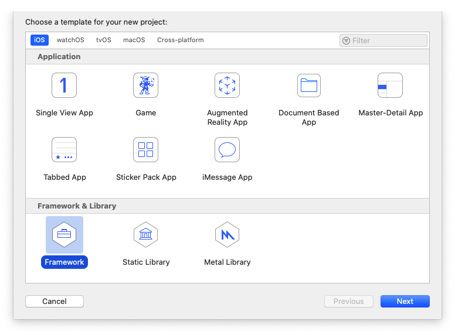
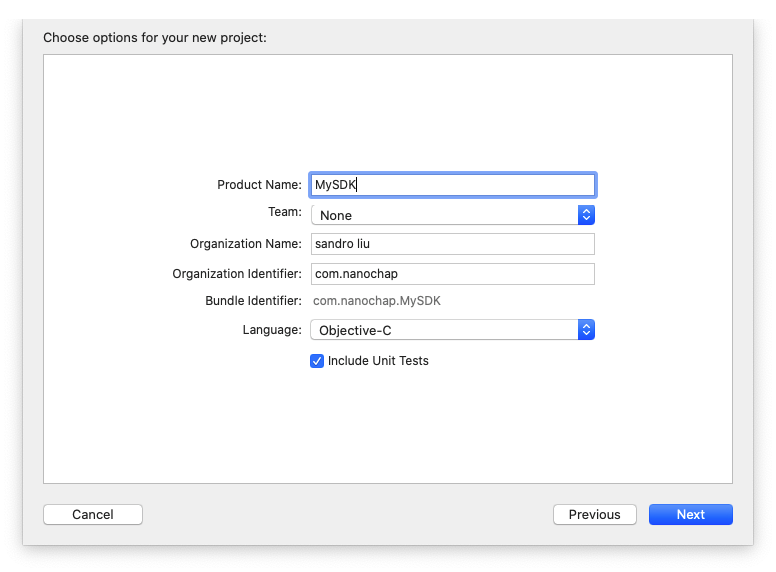
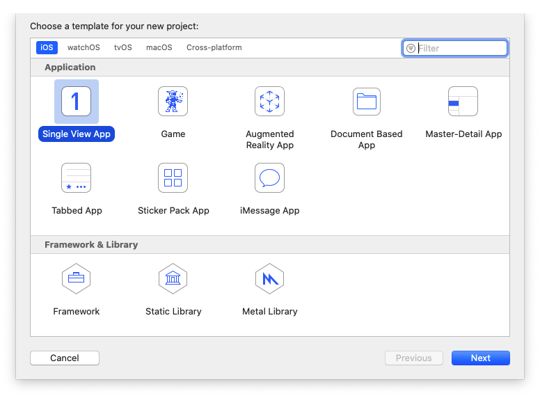
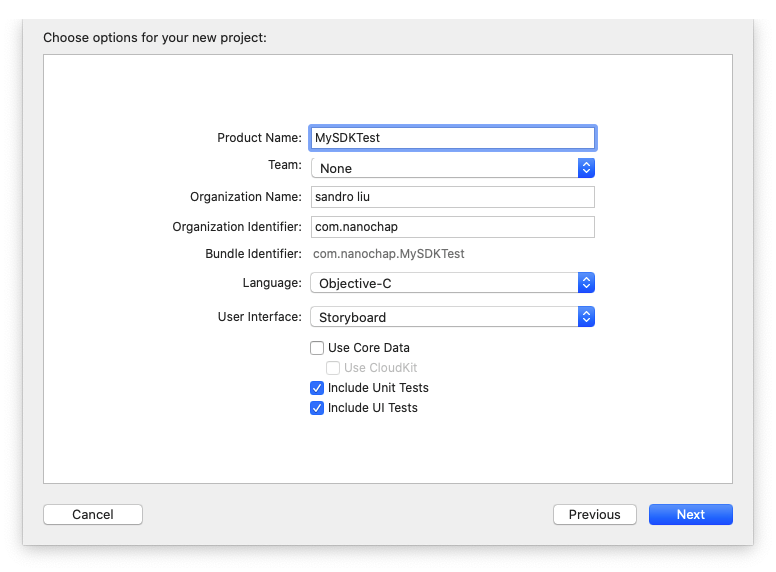
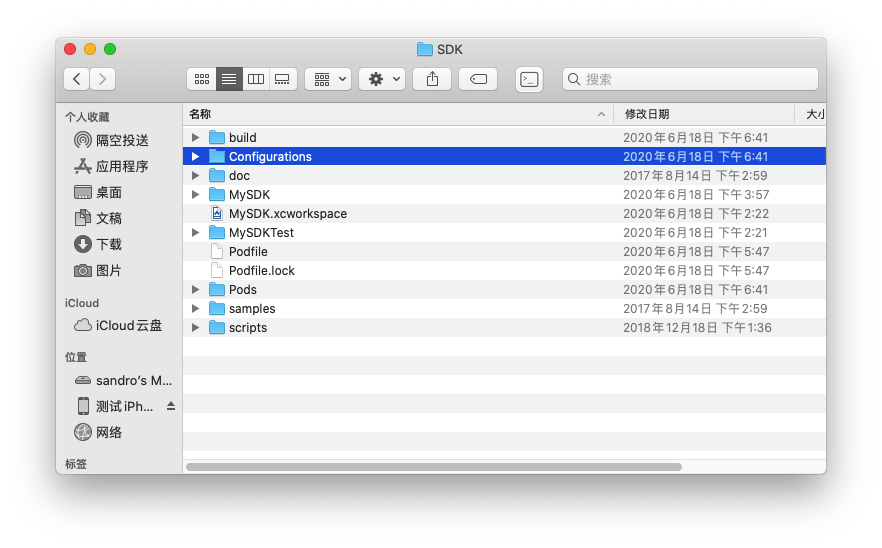
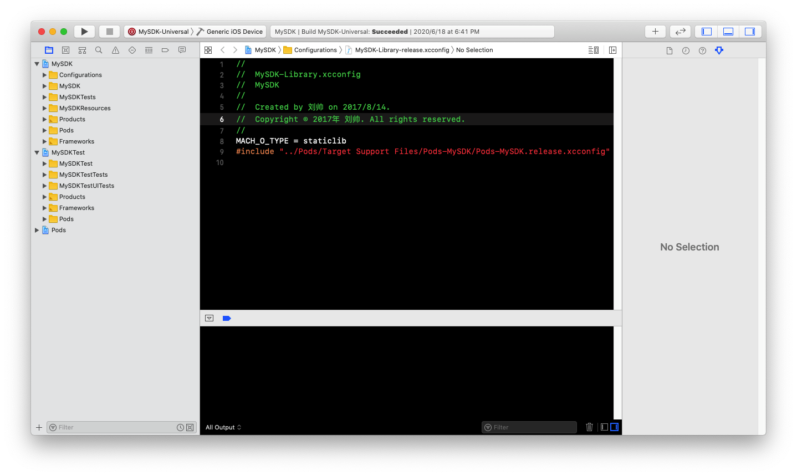
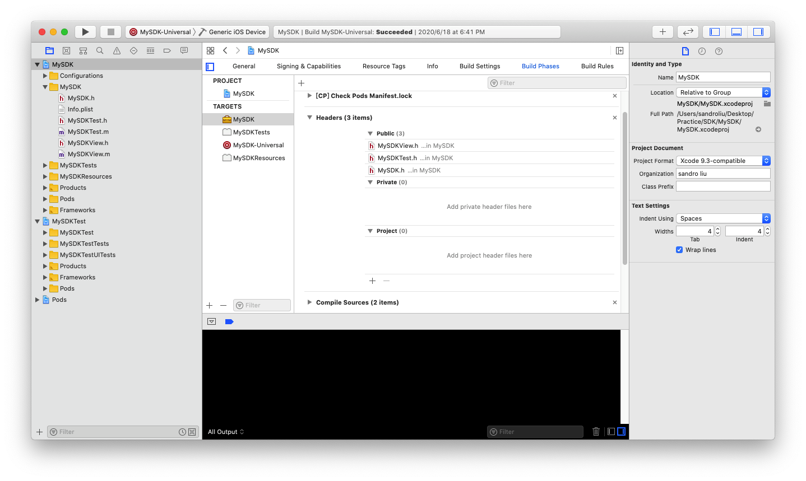
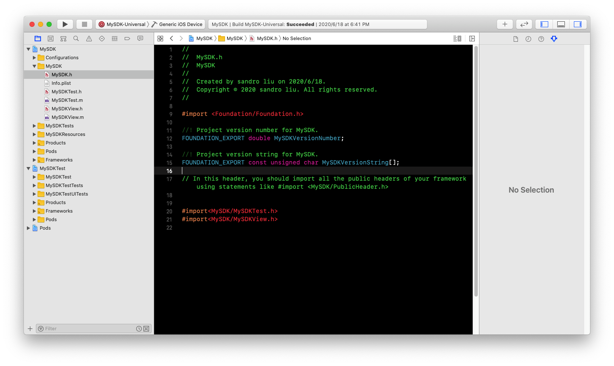
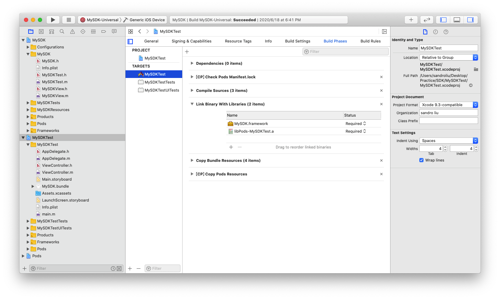
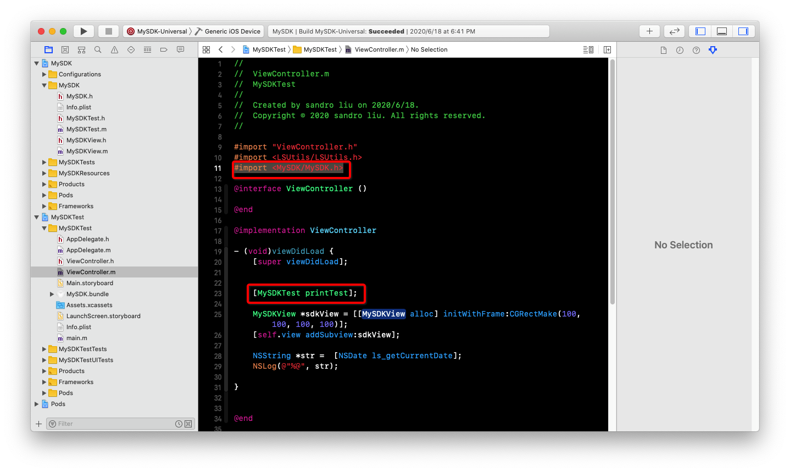

# SDK基础开发

## 创建SDK工程

iOS SDK分为两种样式，一种是`.a`文件，一种是`.framework`文件。`.a`是静态库，`.framework`可以制作成静态库，也可以制作成动态库，本文使用`.framework`静态库方式创建。

#### 创建framework工程
打开xcode创建工程，选择`iOS`，选择`Framework`，点击Next，填写SDK名称，以上操作就是创建SDK的步骤，比较简单。




framework工程存放我们的SDK源码，一般我们还会创建一个测试工程，用来联调我们的SDK。



两个工程创建完成后通过`workspace`进行关联，通过选择`File`->`New`->`Workspace`进行创建。工程创建完成后我们还需要创建几个目录。
	- build: 存放打包后的SDK文件
	- doc: 存放SDK相关文档
	- Configurations: 存放SDK打包配置文件
	- samples: 可以存放示例工程
	- scripts: 存放自动打包脚本




## SDK开发

在SDK工程中创建一个测试类`MySDKTest`，编写一些代码

```objc

#import <Foundation/Foundation.h>

NS_ASSUME_NONNULL_BEGIN

@interface MySDKTest : NSObject

+ (void)printTest;
@end

NS_ASSUME_NONNULL_END

#import "MySDKTest.h"
#import <LSUtils.h>
@implementation MySDKTest

+ (void)printTest {
    NSLog(@"-------------- 111111111 %@", [NSDate ls_getCurrentDate]);
}
@end

```

在 `BuildPhases`->`Headers`里将`MySDKTest.h`设置为公开，将`MySDKTest.h`从`Project`移动到`Public`里


在`MySDK.h`里暴露出`MySDKTest.h`头文件，这样其他人才能使用我们的类


## SDK使用

我们要在测试工程中使用我们创建的SDK，就需要在测试工程用引入SDK，在测试工程的`Build Phases`里引入SDK工程


在需要使用SDK的类里引入头文件`#import <MySDK/MySDK.h>`，调用SDK接口

运行我们的测试工程，查看是否打印了SDK里面的内容。

## 小结

在本文中我们创建了SDK，并在测试工程中使用了SDK，下节我们将介绍如果打包SDK